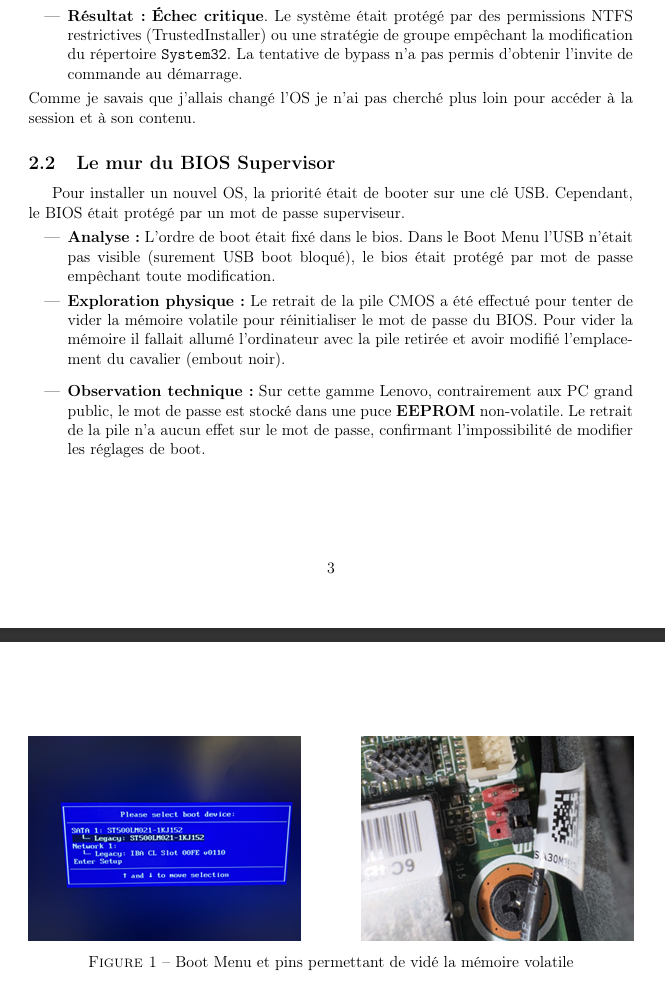

# 🖥️ Home Lab: Lenovo ThinkCentre Rehabilitation

> **Projet de recyclage matériel et déploiement d'une infrastructure serveur Debian Headless.**

## 📸 Aperçu du rapport de projet
Voici un aperçu de la documentation technique et de la configuration finale :

---

## 🎯 Objectifs & Défis
Ce projet documente la transformation d'une station de travail d'entreprise (Lenovo ThinkCentre) initialement inutilisable en un **serveur domestique robuste**. 

### Les obstacles surmontés :
* **BIOS Verrouillé :** Mot de passe superviseur empêchant tout changement de l'ordre de boot.
* **Sécurité Windows 7 Pro :** Session administrateur protégée.
* **Contrainte Matérielle :** Impossibilité de démarrer sur une clé USB d'installation standard.

---

## 🛠️ Solutions Techniques Implémentées

### 1. La Méthode de la "Transplantation"
Pour contourner le blocage du BIOS, j'ai utilisé une approche hardware :
- Extraction du disque dur.
- Installation complète de **Debian 13** via une machine tierce.
- Réinsertion et gestion des conflits de drivers/firmwares propriétaires au premier boot.

### 2. Infrastructure & Services
- **Mode Headless :** Serveur géré exclusivement via SSH.
- **Réseau :** Configuration d'un accès distant sécurisé via **Tailscale (Mesh VPN)** pour outrepasser les contraintes de CGNAT/Redirection de ports.  
- **Virtualisation :** Déploiement de conteneurs **Docker** (Plex, serveurs web, outils de monitoring) 
 en cours 

## 📑 Documentation Complète
Le rapport détaillé (PDF) analyse chaque étape, des échecs initiaux aux solutions finales, incluant la gestion des firmwares non-libres et l'optimisation réseau.

👉 **[Consulter le Rapport Technique (PDF)](/rapport_projet_home_lab.pdf)**

---

## 🧠 Compétences Démontrées
- **Administration Système :** Installation "non-standard" de Linux, gestion des dépôts `non-free`, configuration SSH.
- **Réseau :** Adressage IP statique, VPN Mesh, contournement de NAT.
- **Hardware Hack :** Analyse des limitations du firmware et contournement physique.

